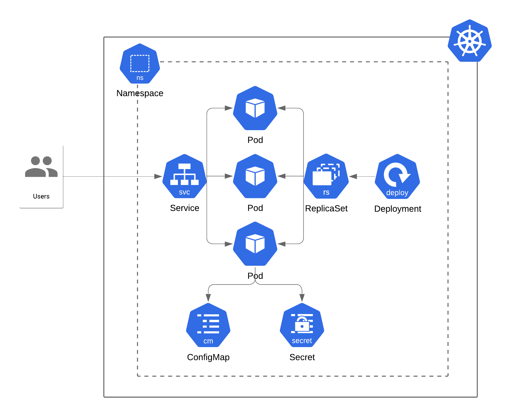

# Kubernetes Sample Application

Basic Kubernetes application for learning purposes. It includes a basic express API served on port 8080, and configuration for Kubernetes Servcie, Deployment, ConfigMap, Secret, and Namespace resources.

The commands assume you will deploy locally to Docker Desktop or Minikube, or `kubectl`'s context is directed at a remote cluster.

## Architecture



## Build and Deployment

1. Build Docker image
```bash
docker build -t demo-app:1 .
```

2. Create resources
```bash
kubectl apply -f k8s/deployment.yaml
```

If successful, the following should appear:

```bash
namespace/demo-namespace created
service/demo-service created
deployment.apps/demo-deployment created
configmap/demo-configmap created
secret/demo-secret created
```

Show all resources in your newly created namespace. An example output is provided.

```bash
kubectl get all,secrets,cm -n demo-namespace
```

Output:
```bash
NAME                                   READY   STATUS    RESTARTS   AGE
pod/demo-deployment-5c54bffdb5-7l9xc   1/1     Running   0          3s
pod/demo-deployment-5c54bffdb5-bqgch   1/1     Running   0          3s
pod/demo-deployment-5c54bffdb5-fl6j5   1/1     Running   0          3s

NAME                   TYPE       CLUSTER-IP      EXTERNAL-IP   PORT(S)        AGE
service/demo-service   NodePort   10.100.149.26   <none>        80:30007/TCP   3s

NAME                              READY   UP-TO-DATE   AVAILABLE   AGE
deployment.apps/demo-deployment   3/3     3            3           3s

NAME                                         DESIRED   CURRENT   READY   AGE
replicaset.apps/demo-deployment-5c54bffdb5   3         3         3       3s

NAME                         TYPE                                  DATA   AGE
secret/default-token-kr99x   kubernetes.io/service-account-token   3      3s
secret/demo-secret           Opaque                                1      3s

NAME                         DATA   AGE
configmap/demo-configmap     1      3s
configmap/kube-root-ca.crt   1      3s
```

## Test

In the above deployment we created a Service with type NodePort. In order to verify our application is running, curl the node port specified in the service configuration. A "Hello World!" message should return.

```bash
$ curl localhost:30007
{"message":"Hello World!"}
```

## Cleanup

```bash
kubectl delete -f k8s/deployment.yaml
```

Output:
```bash
namespace "demo-namespace" deleted
service "demo-service" deleted
deployment.apps "demo-deployment" deleted
configmap "demo-configmap" deleted
secret "demo-secret" deleted
```
